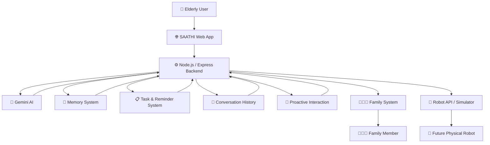
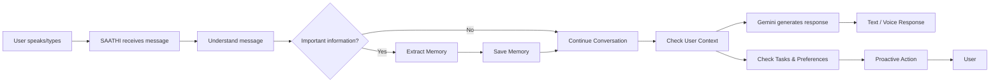
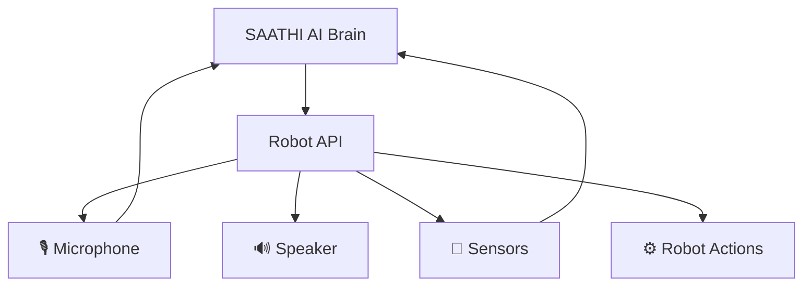
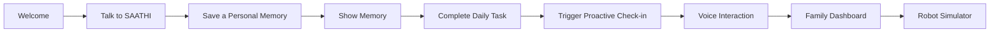

# 🤖 SAATHI — AI Companion for Elderly People

> **Remember. Understand. Assist. Connect.**

SAATHI is an AI companion designed for elderly people. It can remember personal stories and preferences, help with daily activities, proactively interact with the user, connect family members, and communicate through voice.

The long-term vision is to use SAATHI as the **AI brain of a physical companion robot**.

---

## 💡 What SAATHI Does

| Feature | What it does |
|---|---|
| 🧠 **Memory** | Remembers stories, interests, preferences and important personal information |
| 💬 **AI Chat** | Provides warm, simple and personalized conversations |
| 📋 **Daily Tasks** | Helps manage medicine, calls, walks and other activities |
| 🔔 **Proactive Interaction** | Initiates personalized check-ins and suggestions |
| 🎙️ **Voice** | Supports speech input and spoken responses |
| 👨‍👩‍👧 **Family Dashboard** | Shows family useful updates, summaries and activity |
| 🤖 **Robot API** | Provides a software interface for a future physical robot |

---

# 🏗️ System Architecture



---

# 🔄 How SAATHI Works



---

# 🧠 Memory System

The memory system is one of the main parts of SAATHI.

For example:

**User says:**

> "I really love gardening, especially growing roses."

SAATHI can identify this as useful personal information and store it.

```text
User Message
     ↓
Memory Extraction
     ↓
Is it useful?
     ↓
┌────┴────┐
│         │
Yes       No
│         │
↓         ↓
Save      Continue
Memory    Conversation
```

Stored memory can later help SAATHI personalize conversations.

Example:

> "Good morning, Ramesh ji. How are your roses doing today?"

---

# 🤖 Future Robot Architecture

SAATHI is built as a **software-first system** so the AI does not depend on a particular robot.



This means the current software can later become the intelligence layer of a physical companion robot.

---

# 👴 Demo User

### Ramesh Patil — 68

SAATHI's demo profile contains:

- 🌱 Enjoys gardening
- 🌹 Likes growing roses
- 🚆 Worked in the railway sector
- ☀️ Likes morning conversations
- 👨‍👩‍👧 Enjoys family conversations

### Family

- **Meena Patil** — Daughter
- **Amit Patil** — Son

---

# 🛠️ Technology Stack

- **Frontend:** HTML / CSS / JavaScript
- **Backend:** Node.js + Express
- **AI:** Google Gemini API
- **Voice:** Speech-to-Text + Text-to-Speech
- **Memory:** Application memory system
- **Storage:** Local/demo data
- **Family:** Family dashboard and summary system
- **Robot:** Robot API / simulator

---

# 📁 Main Project Structure

```text
saathi/
│
├── server/
│   ├── index.js
│   ├── data/
│   │   └── seed.js
│   └── services/
│       ├── memory.js
│       ├── memoryExtractor.js
│       └── conversation.js
│
├── client/
│   └── ...
│
├── package.json
├── .env
├── .gitignore
└── README.md
```

> The exact frontend structure may change as the project evolves.

---

# 🚀 Current Status

The complete prototype has been implemented.

- ✅ AI conversation
- ✅ Gemini integration
- ✅ User profile
- ✅ Long-term memory
- ✅ AI memory extraction
- ✅ Memory search and retrieval
- ✅ Conversation history
- ✅ Daily tasks and actions
- ✅ Proactive interaction
- ✅ Speech-to-text
- ✅ Text-to-speech
- ✅ Family dashboard
- ✅ Family summaries
- ✅ Robot API
- ✅ Robot simulator
- ✅ Frontend integration
- ⏳ **Deployment — not completed yet**

The project currently runs locally and is ready for deployment.

---

# ▶️ Run Locally

### 1. Install dependencies

```bash
npm install
```

### 2. Create `.env`

```env
GEMINI_API_KEY=YOUR_API_KEY
```

**Never upload `.env` or your API key to GitHub.**

### 3. Start the server

```bash
node server/index.js
```

The local backend runs at:

```text
http://localhost:3000
```

---

# 🎬 Hackathon Demo Flow



A judge can see the complete concept in a few minutes:

1. Meet the elderly user.
2. Talk naturally with SAATHI.
3. Tell SAATHI a personal story.
4. Show that the information becomes a memory.
5. Complete or add a daily task.
6. Trigger a proactive interaction.
7. Demonstrate voice.
8. Show the family dashboard.
9. Finish by showing how the Robot API connects SAATHI to a future physical robot.

---

# 🌱 Future Deployment

The current version is a local prototype. The next step is deployment so the system can be accessed online.

Possible deployment architecture:

```text
             Internet
                 │
        ┌────────▼────────┐
        │  Hosted Frontend│
        └────────┬────────┘
                 │
             HTTPS API
                 │
        ┌────────▼────────┐
        │ Hosted Backend  │
        └────────┬────────┘
                 │
        ┌────────┴─────────┐
        ▼                  ▼
   Gemini API        Memory / Data
```

---

# ❤️ Vision

SAATHI is not designed to be just another chatbot.

The idea is to build a companion that **knows the person behind the conversation** — their stories, interests, routines and relationships.

> **Today, SAATHI is the software brain.  
> Tomorrow, it can become a physical companion.**

---

## ⚠️ Disclaimer

SAATHI is a hackathon prototype. It is not a medical device and does not provide medical diagnosis or replace professional medical or caregiving services.
